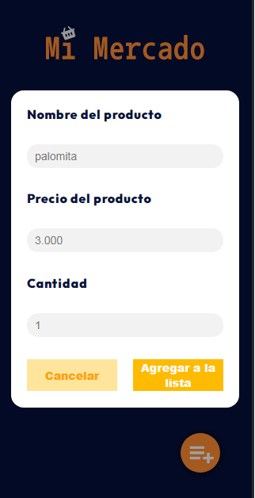
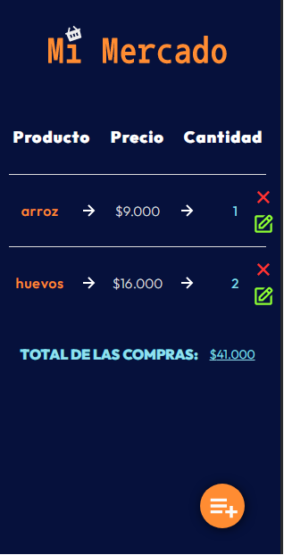

# Mi mercado 🛒

## Tecnologias

   

---

## Live Demo ⚙️

[pagina](https://diegodelgadomao.github.io/mi-mercado-proyecto/) 📂

---

## Descripción 📝

Este proyecto esta hecho con el fin de poner en practica ciertos temas 📚 de React. Hay que tener en cuenta que se inicio con la ayuda de [Create react app](https://github.com/facebook/create-react-app). Se puso en practica temas como los hooks de react, hooks de manejo de estado como **useState**, el hook de efectos (**useEffect**), el hook para manejar el contexto (**useContext**), para manejar variables globales y evitar anidación de props entre componente inecesarios. Y de ultimas pero no menos importante el hook para manejar el estado (**useReducer**), no remplaza a useState pero si se debe usar en casos en que se deba manejar cosas más complejas en la app

El proyecto en general fue construido también para proveer una forma más comoda de hacer las compras 📱 y llevar un registro más legible, dejar a un lado los tediosos números de la calculadora 🧮 y presentar algo un poco más visual 👀.

---

## Instalación 📥

- Clonar el repo
- instalar las dependencias del package.json
- ejecutar **npm start** para correr un entorno de desarrollo para visualizar el proyecto

---

 
